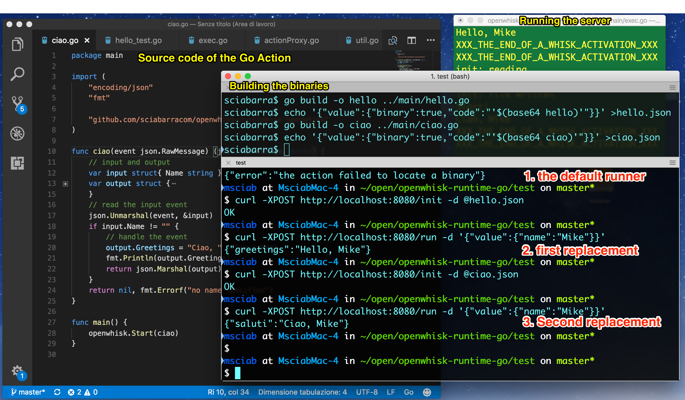

# openwhisk-runtime-go

This is a (work in progress) OpenWhisk runtime for  Golang,  with replacement of the executable as the main server, instead of just invoking a process for each request.



# Background

## How Go actions are currently implemented

Currently, Go actions in OpenWhisk are implemented using the generic Docker support. 

There is a python based server, listening for `/init` and `/run` requests. The `/init` will collect an executable and place in the current folder, while the `/run` will invoke the executable with `popen`, feeding the input and returning the output as log, and the last line as the result as a serialized json.

The problem is that spawning a new process for each request sound like a revival of the CGI.  It is certainly not the most efficient implementation.  Basically everyone moved from CGI executing processes to servers listening for requests since many many years ago.

Just for comparison, AWS Lambda supports Go implementing a server, listening and serving requests. 

## Why the exec?

The problem here is Python and Node are dynamic scripting languages, while Go is a compiled language.

Node and Python runtimes are both  servers, they receive the code of the function, “eval" the code and then execute it for serving requests. 

Go, generating an executable, cannot afford to do that. We cannot “eval” precompiled code. But it is also inefficient to spawn a new process for each function invocation. 

The solution here is to exec only once, when the runtime receive the executable of the function, at the `/init` time. 

Then you should replace the main executable and  serve the `/run` requests directly in the replaced executable. Of course this means that the replaced executable should be able to serve the /init requests too. All of this should go in a library

# How the new support works

The new support for Go will look like the following:

```
package main

import (
	"encoding/json"
	"fmt"

	"github.com/sciabarracom/openwhisk-runtime-go/openwhisk"
)

func hello(event json.RawMessage) (json.RawMessage, error) {
	// input and output
	var input struct{ Name string }
	var output struct {
		Greetings string `json:"greetings"`
	}
	// read the input event
	json.Unmarshal(event, &input)
	if input.Name != "" {
		// handle the event
		output.Greetings = "Hello, " + input.Name
		fmt.Println(output.Greetings)
		return json.Marshal(output)
	}
	return nil, fmt.Errorf("no name specified")
}

func main() {
	openwhisk.Start(hello)
}
```

The magic of serving `/init` and `/run` will live inside the library.

The `Start` function will start a web server listening for  the two requests of the proxy.

Posts to `/run` will invoke some json decoding  and then invoke the function.

Posts to `/init` will receive an executable, place somewhere `action` and then execute to it (expecting of course the server itself is implemented using the same library).  

# Testing the current implementation

First, let's prepare the replacements:

```
cd test
go build -o hello ../main/hello_exec.go
echo '{"value":{"binary":true,"code":"'$(base64 hello)'"}}' >hello.json
```

Now, start the server:

```
go run ../main/exec.go
```

# You can now test the hello functions

Default behaviour (no executable)

```
$ curl -XPOST http://localhost:8080/run -d '{"value":{"name":"Mike"}}'
{"error":"the action failed to locate a binary"}
```

Now post the `hello` handler and run it:

```
$ curl -XPOST http://localhost:8080/init -d @hello.json
OK
$ curl -XPOST http://localhost:8080/run -d '{"value":{"name":"Mike"}}'
{"greetings":"Hello, Mike"}
```

# Benchmarking

There is now a benchmark to compare the performances of the current Docker skeleton with the Go server I developed.

The benchmark is currently just one, run by JMeter against 2 instances, one with the Docker skeleton and another with the Go server.

Tests were run only on OSX currently and Docker for Mac.

Results of the benchmark running 100 theads with 100 requests are pretty eloquent...

|     Label     | # Samples | Average | Median | 90% Line | 95% Line | 99% Line | Min | Max  |
|---------------|-----------|---------|--------|----------|----------|----------|-----|------|
| Python+System |     10000 |     673 |    686 |      766 |      797 |      853 |  10 | 1180 |
| GoServer      |     10000 |       2 |      2 |        3 |        6 |       15 |   1 |   78 |


Also the size of the images is significant:

| sciabarracom/openwhisk-hello   latest              43425039e090        2 hours ago         16.7MB |
| sciabarracom/openwhisk-exec    latest              ba516ca87a68        2 hours ago         10.4MB |
| openwhisk/dockerskeleton       latest              25d1878c2f31        4 months ago        109MB  |
| openwhisk/python3action        latest              e7346758b201        4 months ago        289MB  |

Below there is the description of how to setup the test enviroment if someone wants to repeat the tests...

## Start the Dockerskeleton 

First start the Docker skeleton

```
docker run -p 8080:8080 -ti openwhisk/dockerskeleton
```

Then, in another terminal build an example, publish and test it.

The example is taken from here: [hello_orig.go](https://www.ibm.com/blogs/bluemix/2017/01/docker-bluemix-openwhisk/).

You can do it easily with a few scripts I provided.

```
bin/build.sh main/hello_orig.go
bin/init.sh zip/hello_orig.zip
bin/run.sh '{"name": "Test"}'
```

## Start the server

Here, to make a fair comparison you need to build a docker and place the Go executable in it.

```
cd docker
GOOS=linux GOARCH=amd64 go build -o proxy ../main/exec.go
docker build -t sciabarracom/openwhisk-exec .
docker run -ti -p 8081:8080 sciabarracom/openwhisk-exec
```

Note it is listening on a different port, 8081

You can now publish a replacement exec:

```
GOOS=linux GOARCH=amd64 go build -o exec main/hello_exec.go
PORT=8081 bin/init.sh exec
PORT=8081 bin/run.sh
```

You are ready to run the test. Install JMeter and load the file benchmark/HelloStress.jmx


